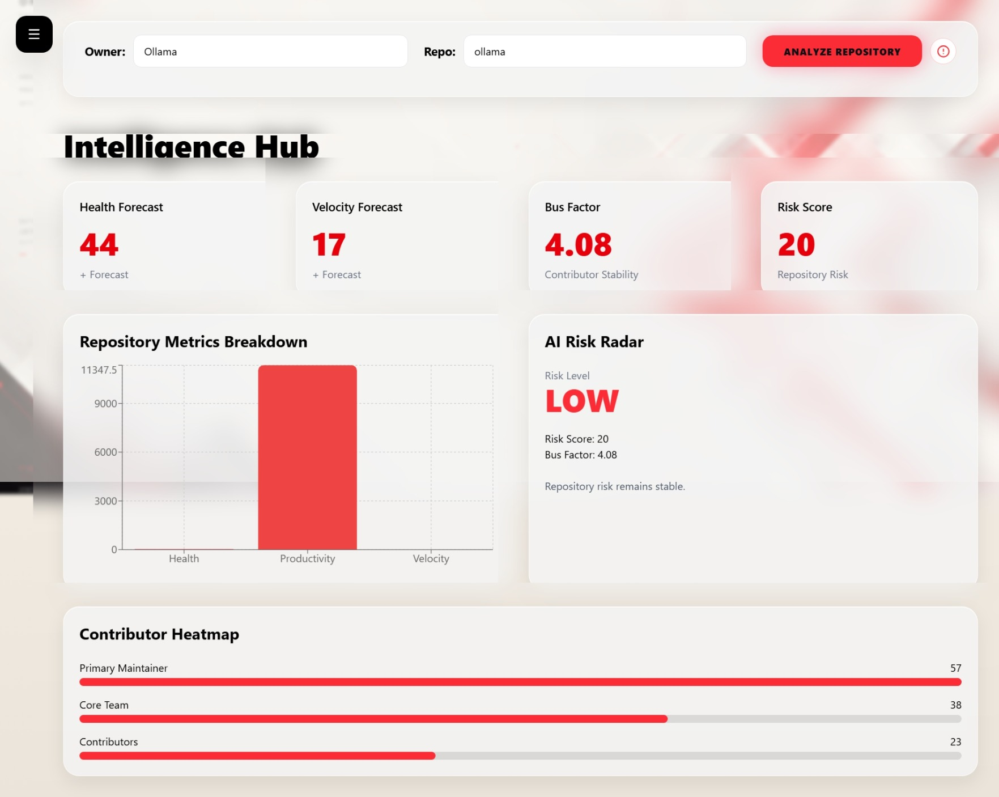
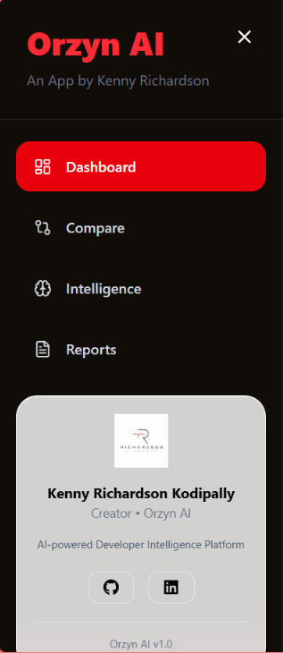

# 🚀 Orzyn AI

### 🧠 AI-Powered Developer Intelligence Platform

Orzyn AI transforms GitHub repositories into actionable engineering intelligence.

Analyze repository health, engineering velocity, contributor concentration, project risk, productivity trends, historical performance, and AI-generated insights through a modern analytics dashboard.

---

## ✨ Features

### 📊 Repository Analytics

* Health Score Analysis
* Engineering Velocity Tracking
* Productivity Metrics
* Contributor Risk Analysis
* Bus Factor Evaluation
* Historical Performance Monitoring

### 🤖 AI & Analytics

* Cloudflare Workers AI Integration
* Llama 3.3 Powered Analysis
* Repository Intelligence Engine
* AI Executive Summary Generation
* AI Risk Assessment Generation
* AI Engineering Roadmap Generation
* Contributor Risk Analysis
* Engineering Velocity Analysis
* Productivity Scoring
* Health Score Calculation
* Forecasting Engine
* Repository Health Analytics

### 📈 Visual Dashboards

* Interactive Charts
* Historical Timelines
* Contributor Analysis
* Repository Comparison
* Executive Reporting

### ⚡ Engineering Metrics

* Health Score
* Productivity Score
* Velocity Score
* Risk Score
* Contributor Concentration
* Repository Stability Indicators

---


## 🏗️ Architecture

```text
apps/
├── api
└── dashboard

packages/
├── ai
├── analytics
├── database
└── github_ingestion
```

---

## 🛠️ Technology Stack

### 🎨 Frontend

* React
* TypeScript
* Vite
* Tailwind CSS
* React Router
* Recharts
* Sonner
* Lucide React

### ⚙️ Backend

* FastAPI
* Python
* Pydantic
* SQLAlchemy
* Alembic
* Uvicorn

### 🗄️ Database

* SQLite
* Repository Analytics Storage
* Historical Snapshot Storage

### 🤖 AI & Analytics

* Repository Intelligence Engine
* Contributor Risk Analysis
* Engineering Velocity Analysis
* Productivity Scoring
* Health Score Calculation
* Forecasting Engine
* AI Report Generation
* Executive Summary Generation

### 🔗 Data Sources

* GitHub REST API
* Repository Metadata
* Commit History
* Contributor Activity
* Repository Statistics

### 📊 Data Visualization

* Recharts
* Interactive Dashboards
* Trend Analysis
* Forecasting Visualizations
* Repository Comparison Analytics

### 🏗️ Monorepo Architecture

* Turborepo
* pnpm Workspaces

### 🔧 Developer Tooling

* Git
* GitHub
* VS Code
* ESLint
* TypeScript
* Prettier


### 🔗 External Services

* GitHub API

---

## 🚀 Getting Started

### 1️⃣ Clone Repository

```bash
git clone https://github.com/kennykrichardson/Orzyn-AI-Developer-Intelligence
cd orzyn-ai-developer-intelligence
```

### 2️⃣ Install Dependencies

```bash
pnpm install
```

### 3️⃣ Start Dashboard

```bash
pnpm dev
```

### 4️⃣ Start Backend

```bash
.venv\scripts\activate
```

```bash
uvicorn apps.api.main:app --reload
```

---

## 📷 Screenshots

### Dashboard Overview


### Comparison Radar


### Intelligence Hub


### Executive Summary Reports


### Navigation Sidebar


---

## 📊 Dashboard Modules

### 🏠 Dashboard

Engineering overview with repository metrics, charts, trends, and health monitoring.

### ⚖️ Compare

Compare repositories across multiple engineering dimensions.

### 🧠 Intelligence

Generate AI-powered engineering insights and repository intelligence.

### 📄 Reports

Generate AI-powered executive summaries, repository risk assessments, engineering roadmaps, contributor intelligence, and repository health reports.

---

## 🔍 Risk Assessment

Orzyn AI uses a multi-factor repository risk model that evaluates:

* Contributor concentration
* Engineering velocity
* Repository health
* Project activity
* Productivity trends

Single-contributor repositories are not automatically classified as high risk. Risk is evaluated in the broader context of repository health and engineering performance.

---

## 🧠 AI-Powered Engineering Intelligence

Orzyn AI leverages Cloudflare Workers AI and Llama 3.3 models to transform repository analytics into actionable engineering intelligence.

Generated outputs include:

* Repository Overview
* Executive Summaries
* Risk Assessments
* Engineering Roadmaps
* Improvement Recommendations
* Engineering Insights

The AI system combines repository metadata, analytics, contributor information, velocity metrics, and health indicators to provide context-aware analysis.

---

## 🎯 Project Goals

* Transform repository data into engineering intelligence.
* Help developers understand project health.
* Identify contributor concentration risks.
* Provide actionable engineering insights.
* Deliver executive-level repository reporting.

---

## ☁️ Deployment

### Frontend

* React
* Vite
* Render Static Site

### Backend

* FastAPI
* Render Web Service

### AI Layer

* Cloudflare Workers AI
* Llama 3.3 70B Instruct

### Data Source

* GitHub REST API

---

## 🌐 Live Application

### Frontend:

https://orzyn-ai.onrender.com

### Backend API:

https://orzyn-api.onrender.com

---

## 👨‍💻 Creator

### Ken Richardson

🏢 Richardson Tech

💻 Developer & AI Engineer

🔗 GitHub: https://github.com/kennykrichardson

---

## 📜 License

This project is licensed under the Orzyn AI Proprietary License.

✅ Personal Use

✅ Educational Use

❌ Commercial Use

❌ Business Use

❌ Redistribution

❌ SaaS Resale

---

## 🔥 Orzyn AI

Engineering Intelligence for Modern Software Teams.
